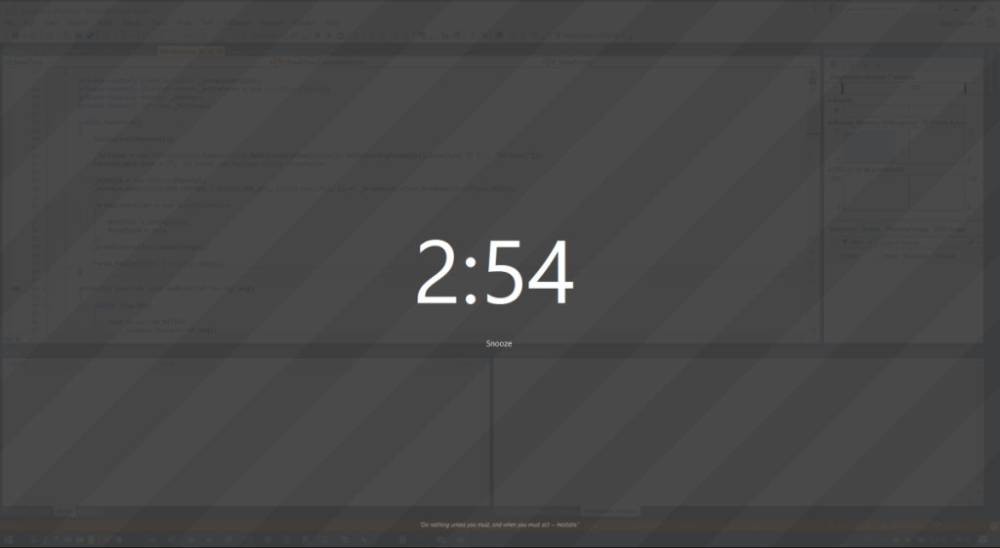

# BreakTime

C# program that forces you to take a break away from the keyboard every so often.

It allows you to set intervals for yourself, like a long break every hour with a short break in between; 
it allows to you snooze up to two times; and it's powered by a really cool state machine (somehow that feels
unimportant).

And, it's rather pretty.

To add fortune cookies to the program: Simply drop a Unix fortune cookie file named "fortunes" into the 
same folder as the program. (Make sure it's the normal format with cookies separated by a single %.)

Just like this:

